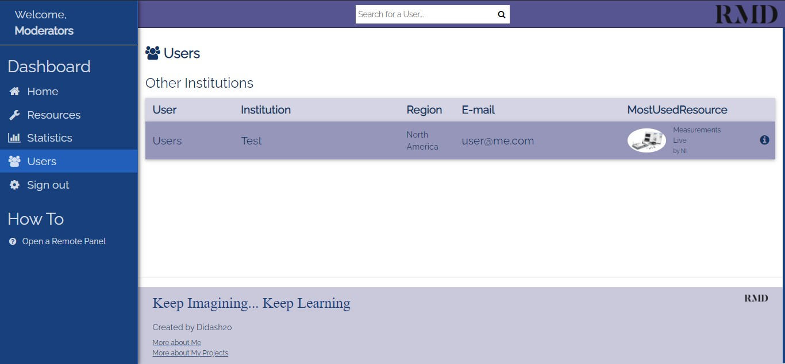

# Remote Device Manager
The Remote Device Manager, or RDM for short, is an intuitive interface made for you to interact with any kind of device capable of hosting a web server. The service allows you to schedule a Resource, and by providing you a unique URL, you will be the only one able to connect to this resource at that given time. You can even share this URL to others, so all those with the link at their disposal will connect to the device at the same time as you do.

## Table of contents
* [General info](#general-info)
* [Screenshots](#screenshots)
* [Technologies](#technologies)
* [Preview](#preview)
* [Status](#status)
* [Sources](#sources)
* [Contact](#contact)

## General info

### The origin of the idea

Remote Device Manager was developed with the idea of creating a remote lab for Educational Institutes or Technology Enterprises where students or clients are able to schedule a device or instrument and use them from a distance.

This idea was originated from the causes lead by the COVID-19 virus, which did not allow students to keep with their studies as they had to learn from home. With the Internet of Things (IoT), there are even more devices and instruments able to host a web server making them available from all around the world. The bad side is that there is not a way to manage those devices, where any person will be able to connect to the device at any time. Creating another problematic where many people could wish to interact with the same device at the same time.

This manager solves the problem by creating reservations where only specific users with a unique URL are able to access the device at that given time. A user must first create an account and book the resource before being able to use it.

### Resources
A Resource is another word for a demo. One same Device can have a huge variety of Resources, it depends on the use you want to give it. For example, a device can be used for medical purposes like reading someones heart rate, or for acquiring data from a temperature gauge in an industrial application. Resources are examples of this applications to let you know what device best fits your needs. You are able to experiment with this applications with real instruments

### Roles
One must register first before being able to interact with the different services within the web app. The web app has three kinds of roles for the accounts, one same account can have multiple roles. The roles available are the following.

* **User**: Has permission to schedule a resource, and even check thier reservations and history. This is the default role when someone signs up.
* **Moderator**: Has permission to see the web page's statistics, such as how many users are registered, which is the most popular resource or how many times a user has scheduled a single resource.
* **Admin**: Has permission to create, edit and delete resources. He is also able to create, edit and delete accounts. Only an administrator can give roles to an account.

Someone that has not been registered yet can still use the resources if a registered user has given him the URL to connect.

## Screenshots

### Home Page

### Resources

### Sign Up

### Schedule

### Reservations

### Statistics

### Users

### Create Resource

## Technologies
* HTML 5
* CSS 3
* Git- version 2.30.0
* Node.js - version 14.15.5
* Nodemon - version 2.0.4
* Bcryptjs - version 2.4.3
* Body-parser - version 1.19.0
* Cookie-parser - version 1.4.5
* Ejs - version 3.1.3
* Express - version 4.17.1
* Jsonwebtoken - version 8.5.1
* Mongoose - version 5.9.22
* Multer - version 1.4.2

## 
Follow this [link](http://didash20.github.io/DIY-Adulting/) to view the home page

## Status
Project is: _Under Development_

## Contact
Created by [@didash20](https://github.com/didash20)